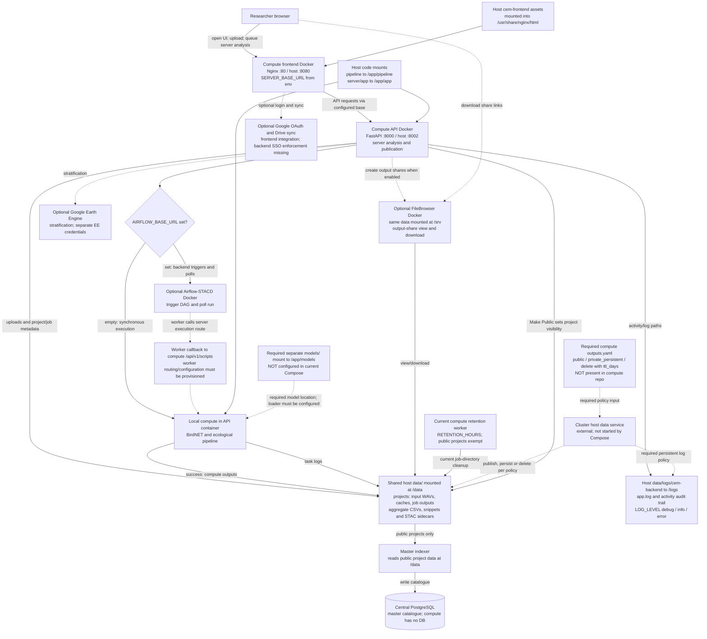

# CEM compute frontend

Researcher workspace for projects, monitoring spots, audio imports, local/server
analysis, and publication to CEM Master. Built with HTML, JavaScript, CSS and
Leaflet; browser storage is initialized separately from optional Google Drive sync.

## Local setup links

- [Local setup guide](https://github.com/err400/cem-master-backend/blob/main/docs/local-setup.md)
- [Full setup and environment guide](https://github.com/err400/cem-master-backend/blob/main/CEM_SETUP_GUIDE.md)


## Setup

The [compute backend](https://github.com/err400/cem-backend) owns the Compose stack
that builds and serves this UI. Keep the repositories side by side or set
`COMPUTE_FRONTEND_CONTEXT` in the compute backend's `.env`.

Follow the [complete setup guide](https://github.com/err400/cem-master-backend/blob/main/CEM_SETUP_GUIDE.md)
for all four repositories and the environment reference. The local UI is
http://localhost:8080; the local compute API is http://localhost:8002.

Deployed UI: https://www.cse.iitd.ernet.in/act4dws5/bio/

Configure `SERVER_BASE_URL` in the compute backend's private `.env` to the actual
public compute API base. Confirm its proxy route; the UI URL does not establish
the API base. Set `ALLOWED_ORIGINS=https://www.cse.iitd.ernet.in` for the deployed
browser origin. The frontend container generates `js/core/Config.js` at startup;
recreate it after environment changes. Do not put backend secrets in browser JS.

## Architecture Diagram

This diagram shows current execution and storage, with unmet cluster requirements
marked **required, not configured**. Solid arrows show current paths; dotted
arrows show optional integrations or required changes. `AIRFLOW_BASE_URL` is the
current switch; the checklist calls it `AIRFLOW_API_BASE` (not supported yet).



The browser calls the compute API, which handles Airflow dispatch and polling;
it does not need direct Airflow access for server analysis. Local execution does
not require an Airflow host. On the current Airflow path, the worker calls the
compute execution endpoint; worker/callback connectivity must be configured on
the cluster, and no `CORESTACK_API_BASE` setting is currently exposed here.

A local browser watcher is a separate execution option: it reads browser-selected
project files and writes local results. These files are not automatically the
server's shared data and are not sufficient for server publication.

The model node is a required change, not an existing mount. Master has no model
weights; compute uses BirdNET loaders, whose model paths must be configured when
introducing that mount. API request and job diagnostics are written to stdout and persistent
`data/logs/cem-backend/app.log`, selected by `LOG_LEVEL=debug|info|error`.
Compute currently uses its own retention worker; full checklist compliance needs
a compute policy file and host-managed enforcement. Separate compute UI/API
containers also remain a checklist gap. External GEE and Drive services are
optional; no GeoServer or object-storage integration is configured in this flow.

## Usage

1. Initialize Storage and choose a local folder (or browser IndexedDB fallback).
2. Create/select a project and add a spot with coordinates.
3. Import WAV recordings named `SPOTNAME_YYYYMMDD_HHMMSS.wav`.
4. Choose server analysis for publication, select BirdNET and the correct dates,
   then wait for successful completion.
5. Make Public; the master indexer reads the shared server data folder.

Google login is optional for Drive synchronization, not required for local
storage initialization. Files imported as references are for the local watcher;
server analysis requires uploadable original files. Browser microphone attachments
are not automatically a substitute for correctly named field WAVs.

For the full verification workflow, see
[HOW_TO_TEST.md](https://github.com/err400/cem-master-backend/blob/main/HOW_TO_TEST.md).

## Log Levels and API Requests

Set `LOG_LEVEL` in the compute backend `.env`; Compose passes it to API/pipeline
and frontend. `DEBUG=true` remains a legacy override; otherwise use `DEBUG=false`.

| Level | Description |
|---|---|
| `debug` | Detailed request/upload/pipeline traces and browser diagnostics, plus normal events and failures |
| `info` | Default: startup, completed API request summaries, job starts/results and failures |
| `error` | Failed HTTP requests (4xx/5xx), unhandled exception types and job failures |

API summaries include method, route template, status, elapsed milliseconds and a
request ID, without headers, query strings or bodies. The API middleware runs at
all levels and preserves streaming responses. Browser traces are enabled only
at debug. Application logs persist at `data/logs/cem-backend/app.log` by default;
`HOST_LOG_DIR` can override that host location. Pipeline/audit/third-party logs
have separate behavior. See the
[logging guide](https://github.com/err400/cem-backend/blob/master/DEBUGGING.md).

```bash
# From the compute backend checkout, after editing .env:
docker compose up -d api frontend
docker compose logs -f api
tail -f data/logs/cem-backend/app.log
```

## Development and diagnostics

Main modules live in `js/core/`, `js/ui/`, `js/services/`, and `js/data/`.
The local watcher is `watcher.py`; use it only for local analysis.

```bash
node --test tests/*.test.mjs
```

See [DEBUGGING.md](https://github.com/err400/cem-frontend/blob/main/DEBUGGING.md) for browser logging and the compute backend's
README for pipeline, FileBrowser, Airflow and Earth Engine configuration.
