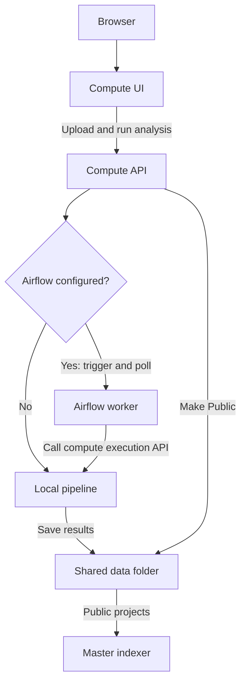
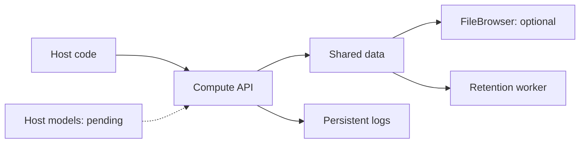

# CEM Frontend

Researcher workspace for projects, monitoring spots, audio imports, local/server
analysis, and publication to CEM Master. Built with HTML, JavaScript, CSS and
Leaflet; browser storage is initialized separately from optional Google Drive sync.

## Local setup links

- [Local setup guide](https://github.com/err400/cem-master-backend/blob/main/docs/local-setup.md)
- [Full setup and environment guide](https://github.com/err400/cem-master-backend/blob/main/CEM_SETUP_GUIDE.md)


## Setup

The [compute backend](https://github.com/err400/cem-backend) owns the Compose stack
that builds and serves this UI. Keep the repositories side by side or set
`COMPUTE_FRONTEND_CONTEXT` in the compute backend's `.env`.

Follow the [complete setup guide](https://github.com/err400/cem-master-backend/blob/main/CEM_SETUP_GUIDE.md)
for all four repositories and the environment reference. The local UI is
http://localhost:8080; the local compute API is http://localhost:8002.

Deployed UI: https://www.cse.iitd.ernet.in/act4dws5/bio/

Configure `SERVER_BASE_URL` in the compute backend's private `.env` to the actual
public compute API base. Confirm its proxy route; the UI URL does not establish
the API base. Set `ALLOWED_ORIGINS=https://www.cse.iitd.ernet.in` for the deployed
browser origin. The frontend container generates `js/core/Config.js` at startup;
recreate it after environment changes. Do not put backend secrets in browser JS.

## Architecture

### How analysis runs



The current switch is `AIRFLOW_BASE_URL`: blank runs locally, set dispatches via
Airflow. The checklist's name `AIRFLOW_API_BASE` is not implemented yet. Airflow
worker callback routing must be configured on the cluster. The UI and API are
currently separate containers; the browser calls the API through `SERVER_BASE_URL`.

### Where files live



| Resource | Current location / behavior |
|---|---|
| API and pipeline code | Host `server/app` → `/app/app`; `pipeline` → `/app/pipeline` |
| UI code | Host frontend assets → `/usr/share/nginx/html` in the UI container |
| Models | Separate `models/` → `/app/models` mount and loader configuration are **pending** |
| Inputs and results | Shared host data folder → `/data`; projects contain WAVs, caches, results, snippets and STAC metadata |
| Logs | Shared data `logs/cem-backend/` → `/logs`; `LOG_LEVEL=debug/info/error`; task logs also live inside project results |
| Downloads | Optional FileBrowser mounts the same data at `/srv` |
| Retention | Current compute worker uses `RETENTION_HOURS`; public projects are exempt |

For cluster compliance, compute still needs `outputs.yaml` covering **public**,
**private_persistent**, and **delete** outputs, enforced by the external host data
service. That policy and enforcement are not currently configured.

Optional external services: **Google Drive** for browser sync and **Google Earth
Engine** for stratification. Browser Google login does not yet enforce backend
SSO. Compute has no database; the master indexer writes to central PostgreSQL.
The browser-local watcher is a separate option and does not automatically write
to the server's shared folder or produce a publishable server job.

## Usage

1. Initialize Storage and choose a local folder (or browser IndexedDB fallback).
2. Create/select a project and add a spot with coordinates.
3. Import WAV recordings named `SPOTNAME_YYYYMMDD_HHMMSS.wav`.
4. Choose server analysis for publication, select BirdNET and the correct dates,
   then wait for successful completion.
5. Make Public; the master indexer reads the shared server data folder.

Google login is optional for Drive synchronization, not required for local
storage initialization. Files imported as references are for the local watcher;
server analysis requires uploadable original files. Browser microphone attachments
are not automatically a substitute for correctly named field WAVs.

For the full verification workflow, see
[HOW_TO_TEST.md](https://github.com/err400/cem-master-backend/blob/main/HOW_TO_TEST.md).

## Log Levels and API Requests

Set `LOG_LEVEL` in the compute backend `.env`; Compose passes it to API/pipeline
and frontend. `DEBUG=true` remains a legacy override; otherwise use `DEBUG=false`.

| Level | Description |
|---|---|
| `debug` | Detailed request/upload/pipeline traces and browser diagnostics, plus normal events and failures |
| `info` | Default: startup, completed API request summaries, job starts/results and failures |
| `error` | Failed HTTP requests (4xx/5xx), unhandled exception types and job failures |

API summaries include method, route template, status, elapsed milliseconds and a
request ID, without headers, query strings or bodies. The API middleware runs at
all levels and preserves streaming responses. Browser traces are enabled only
at debug. Application logs persist at `data/logs/cem-backend/app.log` by default;
`HOST_LOG_DIR` can override that host location. Pipeline/audit/third-party logs
have separate behavior. See the
[logging guide](https://github.com/err400/cem-backend/blob/master/DEBUGGING.md).

```bash
# From the compute backend checkout, after editing .env:
docker compose up -d api frontend
docker compose logs -f api
tail -f data/logs/cem-backend/app.log
```

## Development and diagnostics

Main modules live in `js/core/`, `js/ui/`, `js/services/`, and `js/data/`.
The local watcher is `watcher.py`; use it only for local analysis.

```bash
node --test tests/*.test.mjs
```

See [DEBUGGING.md](https://github.com/err400/cem-frontend/blob/main/DEBUGGING.md) for browser logging and the compute backend's
README for pipeline, FileBrowser, Airflow and Earth Engine configuration.
